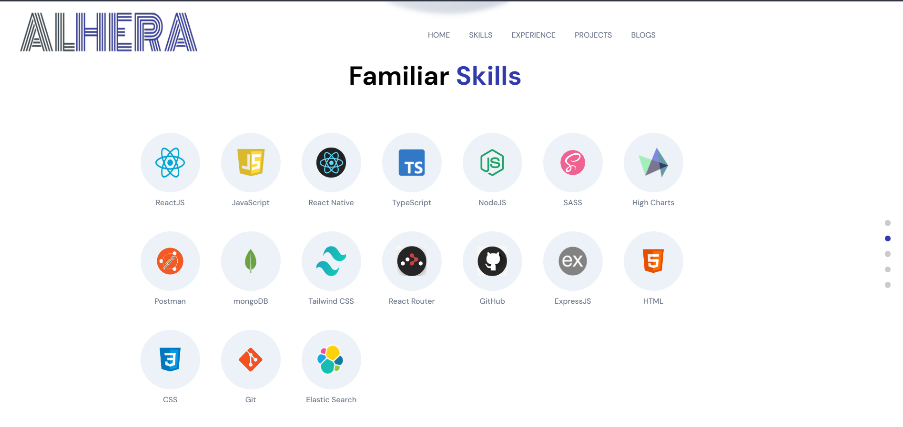

# Portfolio Project
A react app having multiple section to showcase my skills, projects and blogs.

## Live Link
Access this [webApp](https://gentleshah.netlify.app)

## Table of Context:

-[About the App](#about-the-app)

-[Screentshot](#screenshot)

-[Technologies](#technologies)

-[Setup](#setup)

-[Status](#status)

## About the App
It is Portfolio web application made with React, JS , HTML, CSS, SASS and frame motion. This app is written ina modular form of code with clean code practices. This spp showcase all my React, Javascript projects with the github code link and live hosted link. And it has all my blogs links placed in the blogs section.

## Screenshot

## Technologies
HTML, CSS, JS, React, SASS, framer-motion, `font-awesome` & `Icones` for the icons

## Setup
- download or clone the repository
- run `npm install`

## Status
Completed
